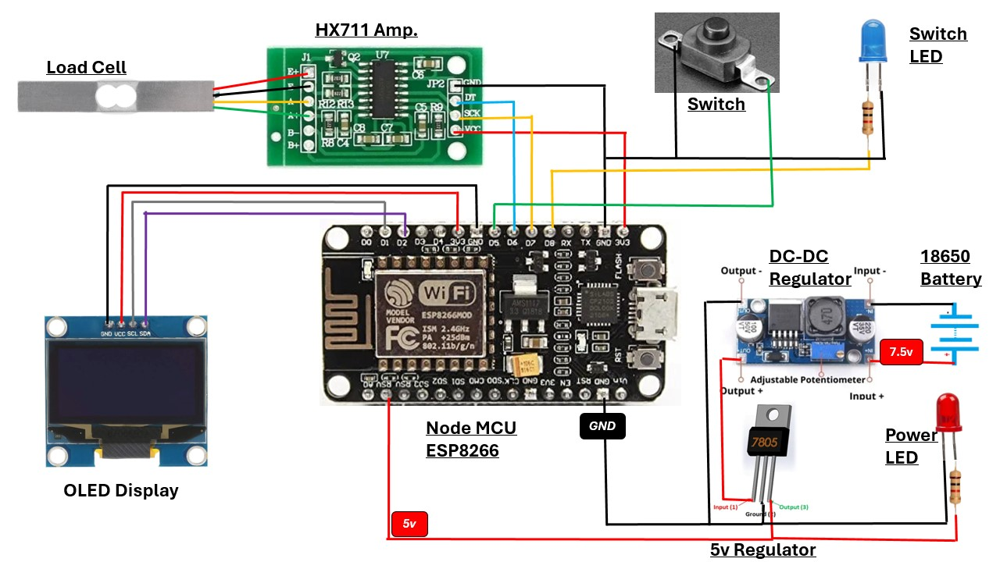

# Device Function

1. As soon as the device starts it checks for configured `wifi` credentials and connects to wifi network.
2. Then it starts reading the `weight scale` and waits for any weight adding to the scale. 
3. Once a weight add to the scale, it immediately increments the counter and displays in the screen. *Both add and remove will increment and decrement the counter acurately*.
4. Mean while, if user press the `button` it will send the `current item count` and send it to the server. The `respose` from the server will be the `cashier No.` and will be displayed to the user. 
5. When the `cashier No.` displays the `Blue LED` will also turn `ON`.
6. If user **switch the button again**, it will again show the current item count and the `Blue LED` turn `OFF`.

# Device Schemetic

## Power Supply
 1. There are 2  `18650 Lithium 3.7v` Batteries.
 2. `DC-DC Regulator` and `7805 5v Regulator` converts the Voltage to stable `5v`.
 3. The red 5v wire from regulator connects to `NodeMCU` Pin `VV` and Black wire connects to any `GND` pin. This powers the `NodeMCU` Module. The `Red LED` just indicates the power supply. 
 4. `NodeMCU` outputs `3.3v` for other pins.
 
 ## OLED Display
  [More Info - 0.96 inch OLED Display with Arduino IDE](https://randomnerdtutorials.com/esp8266-0-96-inch-oled-display-with-arduino-ide/)

 1. `OLED SDA` pin connects to `NodeMCU D2` pin.
 2. `OLED SCL` pin connects to `NodeMCU D1` pin.
 3. Red `3.3v` and Black `GND`.

 > We’re using I2C communication protocol. The most suitable pins for I2C communication in the `NodeMCU` are `GPIO 5 (SCL)` and `GPIO 4 (SDA)`.

 ## Weight Sensor Digital Scale

 [More Info - NodeMCU with Load Cell and HX711 Amplifier (Digital Scale)](https://randomnerdtutorials.com/esp8266-load-cell-hx711/)

 1. `HX711 DT` pin connects to `NodeMCU D6` pin.
 2. `HX711 SCK` pin connects to `NodeMCU D7` pin.
 3. Red `3.3v` and Black `GND`.

## Switch and Blue LED
 1. `Switch` connects to `NodeMCU D5` and `GND` pins.
 2. `Blue LED` connects to `NodeMCU D8` and `GND` pins.